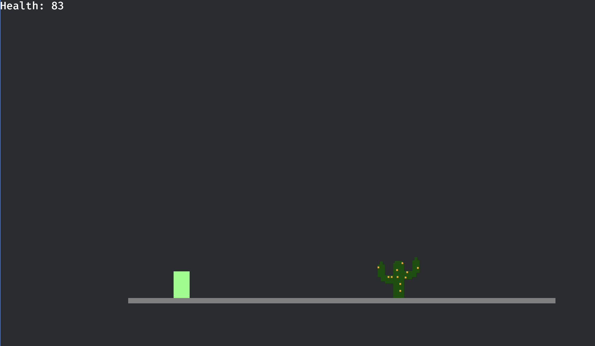

My kindergartner son stumbled upon the Chrome Dino game one fine day when our internet went down (the game where the T-Rex jumps over cacti and ducks pterodactyls in the Chrome browser). He was instantly hooked, and kept finding gaming websites to play the Dino game. 

I wasn’t thrilled about this new obsession. Site blockers and blacklists proved futile—he’d always find another site to play the game. Eventually, I won the battle with a DNS whitelist custom for his device.

When he begged to play again, I refused but offered a compromise: he could play the game if we coded it ourselves.

And so, with the help of [JetBrains blog](https://blog.jetbrains.com/rust/2025/02/04/first-steps-in-game-development-with-rust-and-bevy/) and assistance from DeepSeek, we built a crude version of the Chrome Dino game, written in Rust using the Bevy engine.

## Build Instructions for hosting on local web server
1. ./build_web.sh
2. cd static
   python3 -m http.server 80
3. Find your local IP address:
On Mac: ipconfig getifaddr en0