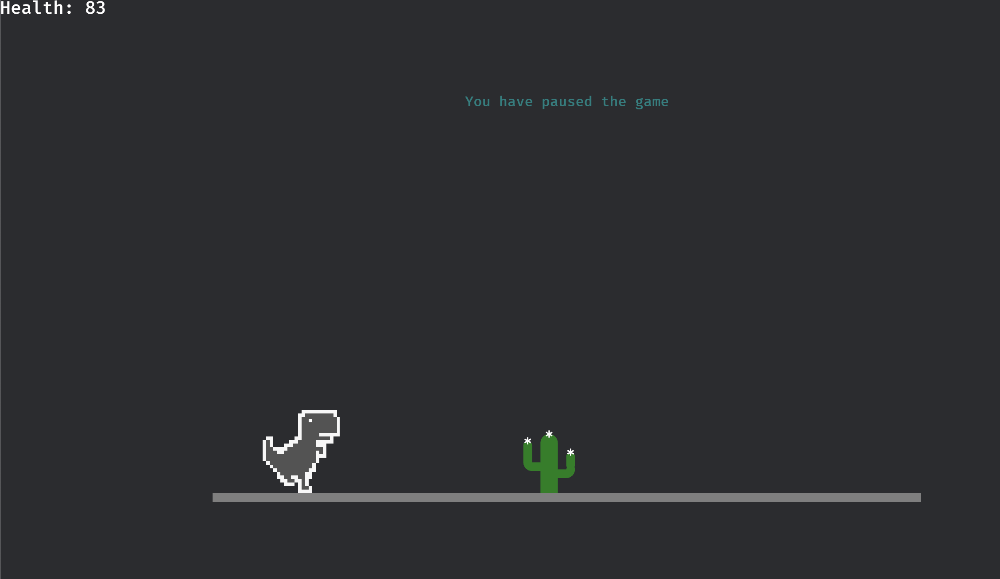

## Origin Story
My kindergartner stumbled upon the [Chrome Dino game](https://en.wikipedia.org/wiki/Dinosaur_Game) one day when our internet went down. He was instantly hooked, and kept finding gaming websites to play the Dino game. 

I wasn’t thrilled about his new obsession. Site blockers and blacklists proved futile—he’d always find another site to play the game. Eventually, I won the battle with a DNS whitelist custom for his device.

When he begged to play again, I offered a compromise: he could play the game if we coded it ourselves.

This is how we came to create our own version of the Chrome Dino game, written in Rust using the Bevy engine.

## Game Design

- Parallax scrolling. Background layers scroll more slowly than foreground layers.
- Parametrically generated cacti.

## Game Demo
Note the gif is a bit choppy.


Here is a screenshot of an earlier version of the game. Progress was made.



## Build instructions for hosting on local web server
1. Target wasm with javascript bindings
    ```bash
    ./build_web.sh
    ```
2. Start a local web server
   ```bash
   cd static
   python3 -m http.server 80
   ```
3. Find your local IP address. On Mac:
   ```
   ipconfig getifaddr en0
   ```

## Daemonization Notes
```text
Dino game is daemonized on my raspberry pi and accessible at max.net.

Enable and start service:
sudo systemctl daemon-reload
sudo systemctl enable dino-game
sudo systemctl start dino-game

Check status:
sudo systemctl status dino-game

Check logs for errors:
journalctl -u dino-game -f

Daemon configuration file:
$ cat /etc/systemd/system/dino-game.service
[Unit]
Description=Dino Game HTTP Server
After=network.target

[Service]
User=pi
ExecStart=/usr/bin/authbind python3 -m http.server 80
WorkingDirectory=/home/pi/dino-game/static
StandardOutput=file:/home/pi/dino-game/static/dino-logs.txt
StandardError=file:/home/pi/dino-game/static/dino-logs.txt
Restart=always
RestartSec=5

[Install]
WantedBy=multi-user.target
```
