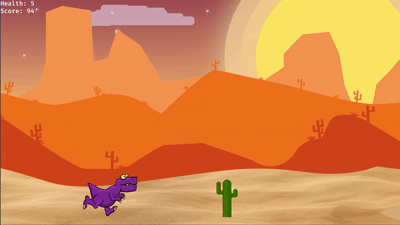

My kindergartner stumbled upon the [Chrome Dino game](https://en.wikipedia.org/wiki/Dinosaur_Game) one day when our internet went down. He was instantly hooked, and kept finding gaming websites to play the Dino game. 

I wasn’t thrilled about his new obsession. Site blockers and blacklists proved futile—he’d always find another site to play the game. Eventually, I won the battle with a DNS whitelist custom for his device.

When he begged to play again, I refused but offered a compromise: he could play the game if we coded it ourselves.

With the help of [JetBrains blog](https://blog.jetbrains.com/rust/2025/02/04/first-steps-in-game-development-with-rust-and-bevy/) and assistance from DeepSeek, we built a version of the Chrome Dino game, written in Rust using the Bevy engine in a week. No pterodactlys in this version, but you will find cheeseburgers. 
## Game Demo



## Build instructions for hosting on local web server
1. Target wasm with javascript bindings
    ```bash
    ./build_web.sh
    ```
2. Start a local web server
   ```bash
   cd static
   python3 -m http.server 80
   ```
3. Find your local IP address. On Mac:
   ```
   ipconfig getifaddr en0
   ```
